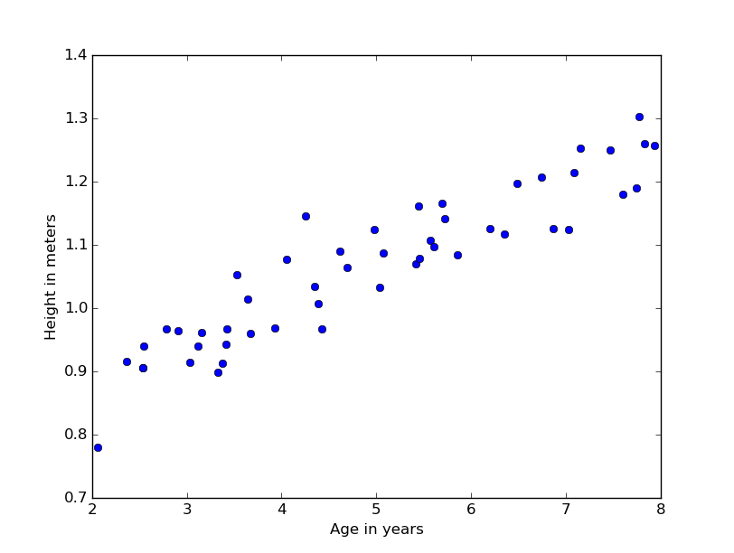
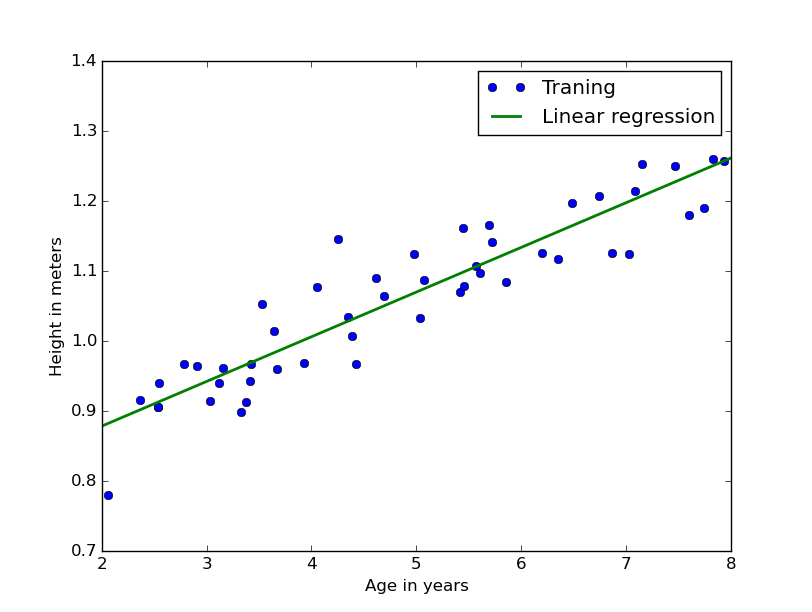

###数据和任务
50个数据样本点，其中x是50个男孩的年龄（2-8岁），y是身高。
对于每一个身高和年龄的元组 $(x^{(i)}, y^{(i)})$ . 有 $m = 50$ 训练样列, 我们会使用这些数据来拟合回归模型。
根据这50个样本数据点，估计3.5岁和7岁的小孩的身高。

###加载数据
使用`python`的`scipy`中的genfromtxt函数加载数据。
``` python
import scipy as sp

x = sp.genfromtxt("ex2x.dat", delimiter="\t")
y = sp.genfromtxt("ex2y.dat", delimiter="\t")
```
样本数据：


###拟合数据
```python
plt.xlabel('Age in years')
plt.ylabel('Height in meters')

fp1, residuals, rank, sv, rcond = sp.polyfit(x, y, 1, full=True)
plt.plot(x,y,'o',label="Traning")
f1 = sp.poly1d(fp1)
fx = sp.linspace(2,8, 1000)
plt.plot(fx, f1(fx),label="Linear regression",linewidth=2)
plt.legend()
```

